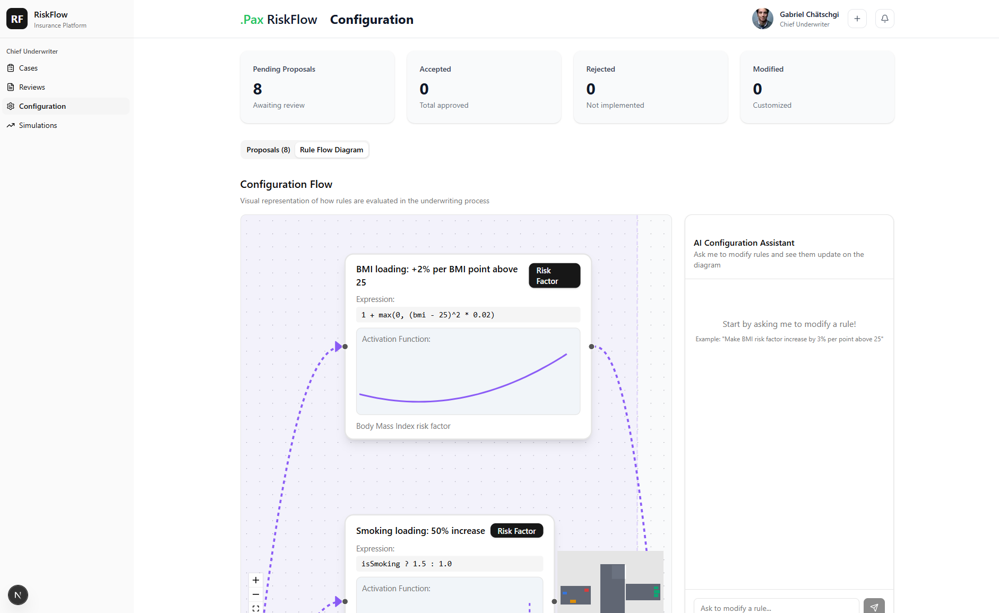

# 🛡️ .Pax RiskFlow

> **AI-Powered Insurance Underwriting System** | Built for BaselHack 2025

Revolutionize insurance underwriting with AI-powered risk assessment, natural language rule configuration, and transparent decision-making.
<p align="center">
  
</p>


---

## 🚀 Quick Start

```bash
# Install dependencies
pnpm install

# Set up environment variables
cp .env.example .env  # Add your DATABASE_URL and OPENAI_API_KEY

# Set up database
pnpm db:generate
pnpm db:migrate
pnpm db:seed

# Start development server
pnpm dev
```
---

## ✨ What Makes It Special?

- 🤖 **AI-Powered Classification** - Converts health descriptions into structured risk data
- 💬 **Natural Language Rules** - Configure underwriting rules by chatting with AI (no coding!)
- 📊 **Visual Rule Flow** - See exactly how decisions are made with interactive graphs
- ⚡ **Database-Backed Config** - Update rules instantly without code deployments
- 👥 **Multi-Tier Reviews** - Underwriters review, adjust, and escalate cases
- 🔍 **Full Transparency** - Complete audit trails for every decision

---

## 🎯 Key Features

### For Customers
- Dynamic product-based surveys
- Instant risk assessment
- Transparent decision breakdowns
- Clear premium calculations

### For Administrators  
- Chat-based rule creation: `"Add BMI loading above 30, 2% per point"`
- Visual rule visualization
- Real-time rule updates
- Complete configuration management

### For Underwriters
- Case review workflow
- System decision confirmation/adjustment
- Escalation to Chief Underwriter
- AI-generated rule proposals

---

## 🛠️ Tech Stack

**Frontend:** Next.js 16 • TypeScript • Tailwind CSS • React Flow  
**Backend:** Prisma • PostgreSQL • OpenAI GPT-4o  
**AI:** Text classification • Natural language rule parsing

---

## 📚 Documentation

For detailed documentation, see **[DOCUMENTATION.md](code/DOCUMENTATION.md)**

Includes:
- Complete architecture overview
- Detailed usage guides
- API reference
- Expression language guide
- Troubleshooting
- Best practices

---

## 🤝 Contributing

Built for **BaselHack 2025**. Contributions welcome!

1. Fork the repository
2. Create a feature branch
3. Make your changes
4. Submit a pull request

---

## 📄 License

See [LICENSE](license.txt) for details.

---

<div align="center">

**Made with ❤️ for BaselHack 2025**

[📖 Full Documentation](code/DOCUMENTATION.md) • [🐛 Report Issue](#) • [💡 Feature Request](#)

</div>
